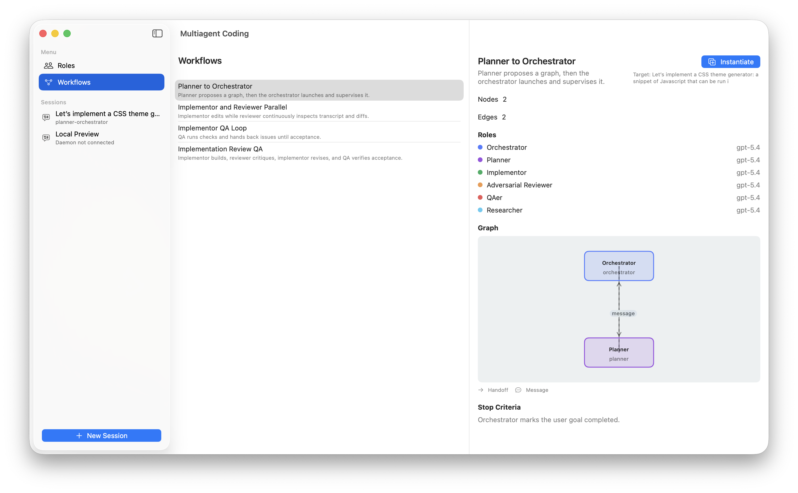

# Multiagent Coding Workflow Engine

A multiagent coding workflow engine, inspired by this post: https://x.com/simonlast/status/2057978156183957995

Principles:
- LLMs are lazy: they take shortcuts, leave stuff unimplemented, don't properly QA 
- If agents are specifically tasks with finding those issues, they are pretty good at it
- If the above is properly implemented, the role of the human becomes more like an overseer, with the goal of keeping the agents as busy as possible

Solution implemented here:
- Create long-lived agents with roles
- They hand off output to other agents, or nudge those agents with messages 
- All of this is observable, represented as workflows
- Workflows are hard-coded into the app, but planner agents decide how and when to instantiate them
- You have the ability to pause or nudge the agents at any point



## Project Structure

- SwiftUI macOS desktop app in `apps/mac`
- Bun/TypeScript daemon in `apps/daemon`
- Shared Zod schemas and protocol types in `packages/shared`
- Append-only session logs under `sessions/<sessionId>/`

## Development

```sh
npm install
npm run typecheck
npm test
npm run daemon
npm run dev:node -w @multiagent/daemon # fallback when Bun is unavailable
./script/build_and_run.sh
```

The daemon is Bun-targeted. This checkout also keeps service code testable under Node for local validation when Bun is not installed.
